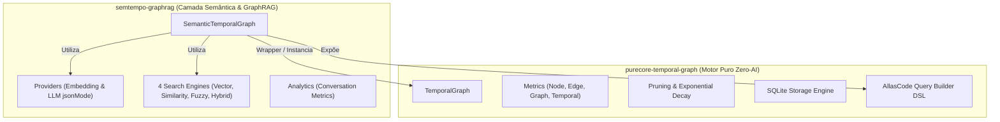

# Arquitetura do Projeto: Separação de Módulos

Este documento detalha o mapa da arquitetura e a separação de responsabilidades entre o motor de grafo puro (`purecore-temporal-graph`) e a camada semântica (`semtempo-graphrag`).



---

## 1. `purecore-temporal-graph/` (Motor Puro - Zero AI)

**Propósito**: Engine de grafo temporal determinístico e de alta performance em TypeScript puro, livre de quaisquer dependências de LLM ou embeddings de inteligência artificial.

### Estrutura de Arquivos
```
purecore-temporal-graph/
├── src/
│   ├── temporalGraph.ts       # Motor base de grafo temporal com arestas intervalares
│   ├── graph.ts               # Grafo não-direcionado base
│   ├── directedGraph.ts       # Grafo direcionado com detecção de ciclos
│   ├── directedAcyclicGraph.ts# DAG com ordenação topológica
│   ├── errors.ts              # Exceções customizadas (NodeAlreadyExists, CycleError)
│   ├── metrics/               # Métricas determinísticas
│   │   ├── nodeMetrics.ts     # Grau temporal, lifespan, burstiness
│   │   ├── edgeMetrics.ts     # Duração, média, recorrência
│   │   ├── graphMetrics.ts    # Densidade temporal, overlap, velocidade
│   │   └── temporalMetrics.ts # Aceleração, ritmo de ativação, alive ratio
│   ├── pruning/               # Algoritmos de compressão e poda
│   │   ├── decay.ts           # Decay exponencial S(e,t) = w * e^(-λΔt) + accessBoost
│   │   └── graphPruner.ts     # Poda de arestas por score, remoção de nós isolados e compressão
│   ├── storage/               # Adaptadores de persistência e travessia
│   │   ├── types.ts           # Interface IGraphStorageAdapter
│   │   └── sqliteStorage.ts   # Engine SQLite com travessia BFS / CTE recursiva
│   ├── dsl/                   # AllasCode Style Query Builder
│   │   ├── types.ts           # AST e opções de consulta
│   │   └── queryBuilder.ts    # API fluente (.withinTimeRange, .fromNode, .traverse, .filterNode)
│   └── index.ts               # Ponto de entrada do pacote @purecore/temporal-graph
└── test/                      # Testes unitários e de integração (100% cobrindo o motor puro)
```

---

## 2. `semtempo-graphrag/` (Camada Semântica & GraphRAG)

**Propósito**: Camada semântica avançada e orquestração de GraphRAG construída como um wrapper sobre o `@purecore/temporal-graph`. Integre embeddings, chamadas LLM estruturadas e buscas híbridas.

### Estrutura de Arquivos
```
semtempo-graphrag/
├── src/
│   ├── semanticTemporalGraph.ts # Wrapper semântico sobre TemporalGraph
│   ├── types.ts                 # Contratos de dados semânticos e opções de busca
│   ├── providers/               # Provedores de IA e conectores de API
│   │   ├── embedding.ts         # OpenAI e OpenRouter Embedding providers
│   │   └── llm.ts               # OpenAI e OpenRouter LLM providers com suporte a jsonMode
│   ├── search/                  # 4 Motores de busca semântica
│   │   ├── vector.ts            # Busca vetorial em múltiplos campos com fallback
│   │   ├── similarity.ts        # Similaridade de cosseno via embeddings
│   │   ├── fuzzy.ts             # Busca por distância de Levenshtein
│   │   ├── hybrid.ts            # Busca híbrida combinada
│   │   └── index.ts             # Exportação unificada dos 4 motores de busca
│   ├── analytics/
│   │   └── conversation.ts      # Analytics e métricas semânticas de conversas (com extractJSON resiliente)
│   └── index.ts                 # Ponto de entrada do pacote @purecore/semtempo-graphrag
└── test/                        # Testes da camada semântica
```

---

## 3. `packages/temporal-graph-zig/` (Motor Nativo Zig - High Performance)

**Propósito**: Implementação nativa em Zig (v0.16) com altíssima performance, zero dependências externas e gerenciamento manual determinístico de memória.

### Estrutura de Arquivos
```
packages/temporal-graph-zig/
├── build.zig                  # Build system Zig 0.16 (module, lib, exe CLI e tests)
├── build.zig.zon              # Manifesto do pacote
├── src/
│   ├── root.zig               # Re-exportações públicas da biblioteca
│   ├── graph.zig              # Node, TemporalEdge e TemporalGraph
│   ├── metrics.zig            # Sweep-line O(n log n), densidade, aceleração, lifespan
│   ├── pruning.zig            # Decaimento exponencial e relevância
│   └── main.zig               # CLI executável de demonstração
├── test/
│   └── temporal_graph_test.zig# Suíte completa de testes unitários
└── README.md
```

---

## 4. Diretrizes de Manutenção & Escalabilidade

1. **Separação Rigorosa**: Nenhuma alteração em `temporal-graph` ou `temporal-graph-zig` deve importar bibliotecas de IA ou provedores externos.
2. **Reuso Transparente**: O `SemanticTemporalGraph` delega a execução de operações temporais, travessias e pruning ao `TemporalGraph` subjacente.
3. **Persistência Híbrida**: O `SQLiteGraphStorage` em `temporal-graph` aceita metadados e vetores semânticos como carga útil (JSON payload), permitindo que travessias recursivas e consultas temporais rodem diretamente em SQL enquanto o `semtempo-graphrag` lida com o embedding e descompactação semântica.
4. **Paridade Algorítmica**: Toda nova métrica ou otimização algorítmica (como $O(n \log n)$ de overlap) deve manter paridade exata entre as implementações TypeScript e Zig.
